## 规则标签类型

### 标签模型：用户性别标签

> 向以规则匹配中性别标签为例，开发整个标签模型，熟悉开发过程，对标签的构建整体认识，如下为管理平台首先需要新建标签


标签模型开发具体流程，数据流程详细图如下所示：


~~~ mysql
CREATE TABLE `tbl_basic_tag` (
`id` bigint(20) NOT NULL AUTO_INCREMENT,
`name` varchar(50) DEFAULT NULL COMMENT '标签名称',
`industry` varchar(30) DEFAULT NULL COMMENT '行业、子行业、业务类型、标签、属
性',
`rule` varchar(300) DEFAULT NULL COMMENT '标签规则',
`business` varchar(100) DEFAULT NULL COMMENT '业务描述',
`level` int(11) DEFAULT NULL COMMENT '标签等级',
`pid` bigint(20) DEFAULT NULL COMMENT '父标签ID',
`ctime` datetime DEFAULT NULL COMMENT '创建时间',
`utime` datetime DEFAULT NULL COMMENT '修改时间',
`state` int(11) DEFAULT NULL COMMENT '状态：1申请中、2开发中、3开发完成、4已上
线、5已下线、6已禁用',
`remark` varchar(100) DEFAULT NULL COMMENT '备注',
PRIMARY KEY (`id`)
) ENGINE=InnoDB AUTO_INCREMENT=307 DEFAULT CHARSET=utf8 COMMENT='基础标签
表';

CREATE TABLE `tbl_model` (
`id` bigint(20) NOT NULL AUTO_INCREMENT,
`tag_id` bigint(20) DEFAULT NULL,
`model_name` varchar(200) DEFAULT NULL,
`model_main` varchar(200) DEFAULT NULL,
`model_path` varchar(200) DEFAULT NULL,
`sche_time` varchar(200) DEFAULT NULL,
`ctime` datetime DEFAULT NULL,
`utime` datetime DEFAULT NULL,
`state` int(11) DEFAULT NULL,
`args` varchar(100) DEFAULT NULL,
PRIMARY KEY (`id`)
) ENGINE=InnoDB AUTO_INCREMENT=2 DEFAULT CHARSET=utf8;

-- 1、基础标签tbl_basic_tag
INSERT INTO `tbl_basic_tag` VALUES ('318', '性别', null,
'inType=hbase\nzkHosts=bigdatacdh01.itcast.cn\nzkPort=2181\nhbaseTable=tbl_tag_users\nfamily=detail\nselec
tFieldNames=id,gender', null, '4', '314', '2019-12-03 11:11:54', '2019-12-03
11:11:54', null, null);
INSERT INTO `tbl_basic_tag` VALUES ('319', '男', null, '1', null, '5',
'318', '2019-12-03 11:28:03', '2019-12-03 11:28:03', null, null);
INSERT INTO `tbl_basic_tag` VALUES ('320', '女', null, '2', null, '5',
'318', '2019-12-03 11:28:39', '2019-12-03 11:28:39', null, null);

-- 2、模型表tbl_model
INSERT INTO `tbl_model` VALUES ('1', '318', 'MATCH',
'cn.itcast.tags.models.rule.GenderModel', 'hdfs://bigdatacdh01.itcast.cn:8020/apps/temp/jars/9f0d015b-8535-4538-8722-
1d9a331069d1.jar', '4,2019-12-03 10:00:00,2029-12-03 10:00:00', '2019-12-03
11:11:54', '2019-12-03 11:11:54', '4', '--driver-memory 512m --executormemory 512m --num-executors 1 --executor-cores 1');
~~~

相关字段信息如下：

~~~ shell
标签名称：性别
标签分类：电商-某商城-人口属性
更新周期：
业务含义：注册会员的性别
标签规则：
inType=hbase
zkHosts=bigdata-cdh01.itcast.cn
zkPort=2181
hbaseTable=tbl_tag_users
family=detail
selectFieldNames=id,gender
程序入口：
cn.itcast.tags.models.rule.GenderModel
算法名称：
MATCH
算法引擎：
tags-model_2.11.jar
模型参数：
--driver-memory 512m --executor-memory 512m --num-executors 1 --
executor-cores 1
~~~

主要分为四个步骤：

~~~shell
// 1 依据TagId,从MySQL读取标签数据
// 2 解析标签rule,从HBase读取业务数据
// 3 业务数据结合标签属性数据，构建标签
// 4 画像标签数据存储HBase表
~~~

涉及技术核心点（难点）

~~~ shell
第一、如何从HBase表读取和写入数据
第二、标签匹配与标签合并
标签合并：将历史标签数据与计算标签数据进行合并
第三、基于DataFrame DSL开发
使用select,filter,groupBy,agg等函数，内置函数：functions._
~~~

标签数据读取

首先从基础标签表tbl_basic_tag 中读取性别相关的标签数据： 业务标签和属性标签。

依据业务标签ID读取标签相关的数据： 业务标签数据和对应属性标签数据，sql如下：

~~~mysql
(
SELECT `id`,
`name`,
`rule`,
`level`
FROM `profile_tags`.`tbl_basic_tag`
WHERE id = 318
UNION
SELECT `id`,
`name`,
`rule`,
`level`
FROM `profile_tags`.`tbl_basic_tag`
WHERE pid = 318
ORDER BY `level` ASC, `id` ASC
) AS basic_tag
~~~

查询结果如下： 


读取Hbase表的业务数据：

业务数据存储在HBase表中，此处采用TableInputFormt的方式读取数据，编写工具类，其中涉及如何将RDD转换为DataFrame。

构建标签：

依据获取的业务属性标签数据中的规则，进行关联匹配，构建每个用户的性别标签，如下图示：


### 标签模型：职业标签

在标签管理平台新建对应的标签（业务标签和属性标签），编写标签模型类，实现标签计算。

~~~mysql
`job` varchar(60) DEFAULT NULL COMMENT '职业；1学生、2公务员、3军人、4警察、5教
师、6白领'
-- SQL 语句
SELECT job, COUNT(1) AS cnt FROM tags_dat.tbl_users GROUP BY job ;
~~~


**新建标签**

新建业务（4级）标签：职业标签，相关字段信息如下：

~~~shell
标签名称：职业
标签分类：电商-某商城-人口属性
更新周期：
业务含义：注册用户的职业
标签规则：
inType=hbase
zkHosts=bigdata-cdh01.itcast.cn
zkPort=2181
hbaseTable=tbl_tag_users
family=detail
selectFieldNames=id,job
程序入口：
cn.itcast.tags.models.rule.JobModel
算法名称：
MATCH
算法引擎：
tags-model_2.11.jar
模型参数：
--driver-memory 512m --executor-memory 512m --num-executors 1 --
executor-cores 1
~~~

新建属性（5级）标签：1 学生、 2 公务员、3 军人、4 警察、5 教师、6 白领，相关字段信息

**模型开发**

在标签管理平台web新建标签，（业务标签4级标签和属性标签5级标签），参考用户性别标签模型修改其中标签的计算部分，使用UDF函数，完成标签匹配计算。


**优化项**
        对于开发规则规则匹配类型标签，用户性别标签和用户职业标签计算标签时，分别使用DataFrame Join 和 自定义UDF函数关联给咱，计算获取的对应标签ID.

​         因为Join操作对两个表key值相同额记录进行连接，在SparkSql中，对两个表做Join最直接的方式是先根据key分区，再在每个分区找那个把key值相同的记录拿出来做连接操作。但这样就不可避免地涉及shuffle,而shuffle在Spark是比较耗时的操作，应该尽可能的设计spark应用避免大量避免大量的shuffle.
当维度表（小表）和事实表（大表）进行join操作时，为了避免shuffle,可以将大小有限的维度表（小表）的全部数据分发到每个节点上，供事实表使用。executor存储维度表的全部数据，一定程度牺牲了空间，换取了shuffle操作大量耗时，这个在sparkSql称作BroadCast join.


### 标签模型：政治面貌

在标签管理平台新建对应的标签（业务标签和属性标签），编写标签模型类，继承标签模型基类BasticModel,实现其中标签的计算方法dotTag.

~~~sql
`politicalFace` int(1) unsigned DEFAULT NULL COMMENT '政治面貌：1群众、2党员、3
无党派人士'
~~~

**新建标签**

新建业务（4级）标签：政治面貌，相关字段如下：

~~~shell
标签名称：政治面貌
标签分类：电商-某商城-人口属性
更新周期：
业务含义：注册用户的政治面貌
标签规则：
inType=hbase
zkHosts=bigdata-cdh01.itcast.cn
zkPort=2181
hbaseTable=tbl_tag_users
family=detail
selectFieldNames=id,politicalface
程序入口：
cn.itcast.tags.models.rule.PoliticalModel
算法名称：
MATCH
算法引擎：
tags-model_2.11.jar
模型参数：
--driver-memory 512m --executor-memory 512m --num-executors 1 --
executor-cores 1
~~~

新建属性（5级）标签：1 群众、2党员、3无党派人士，相关字段信息如下：

~~~shell
1）、属性值【群众】
标签名称：群众
标签含义：政治面貌为群众
标签规则：1
2）、属性值【党员】
标签名称：党员
标签含义：政治面貌为党员
标签规则：2
3）、属性值【无党派人士】
标签名称：无党派人士
标签含义：政治面貌为无党派人士
标签规则：3
~~~

### 标签模型：国籍

新建业务标签（4级）： 国籍，相关字段信息如下：

~~~shell
标签名称：国籍
标签分类：电商-某商城-人口属性
更新周期：
业务含义：注册用户所属的国籍：中国大陆、中国香港、中国澳门、中国台湾、其他
标签规则：
inType=hbase
zkHosts=bigdata-cdh01.itcast.cn
zkPort=2181
hbaseTable=tbl_tag_users
family=detail
selectFieldNames=id,nationality
程序入口：
cn.itcast.tags.models.rule.NationalityModel
算法名称：
MATCH
算法引擎：
tags-model_2.11.jar
模型参数：
--driver-memory 512m --executor-memory 512m --num-executors 1 --
executor-cores 1
~~~

新建属性（5级）标签：1中国大陆、2中国香港、3中国澳门、4中国台湾、5其他，相关字段信息如下：

~~~shell
1）、属性值【中国大陆】
标签名称：中国大陆
标签含义：国籍是中国大陆
标签规则：1
2）、属性值【中国香港】
标签名称：中国香港
标签含义：国籍是中国香港
标签规则：2
3）、属性值【中国澳门】
标签名称：中国澳门
标签含义：国籍是中国澳门
标签规则：3
4）、属性值【中国台湾】
标签名称：中国台湾
标签含义：国籍是中国台湾
标签规则：4
5）、属性值【其他】
标签名称：其他
标签含义：国籍是其他
标签规则：5
~~~


### 标签数据总述

每一个标签模型任务流程如下所示：


用户画像标签系统中的每个标签（业务标签、4级标签）的模型开发，涉及到三种类型的数据，如下图：


具体说明：

* 1、标签数据

  每个标签模型开发（给每个用户或每个商品打每个标签），必须先在标签管理平台注册【新建标
  签】
  业务标签（4级标签）、属性标签（5级标签）
  注册以后，每个标签（业务标签）对应的属性值（属性标签）都有对应标签标识符：tagId
  属性标签ID，标识每个标签，将会打到每个用户或商品上，标识此用户或商品的具体标签
  每个业务标签对应一个模型，就是一个Spark Application程序
  运行此应用程序可以给用户或商品打标签
  在模型表中记录标签对应的模型关系，以及模型运行时参数信息

  

* 2、 业务数据

  每个标签（业务标签，4级标签）开发，需要读取对应的业务数据，比如用户性别标签，需要读取【注册会员表】数据（获取用户ID：id和用户性别：gender），进行打标签。本项目中主要涉及到四类业务数据，给用户和商品打标签，构建画像。

  

* 3、 画像标签数据

  给每个用户或每个商品打上标签以后，存储到HBase表及Elasticsearch索引中，便于查询检索
  使用
  画像标签表名称：
  tbl_profile, user

​      

### 自定义外部数据源

在标签模型编码中，需要从HBase表读写数据，编写HBaseTools工具类，其中提供read和write方法，传递参数读写表的数据，但是能否实现类似SparkSQL读写MySql数据库表数据时如下格式：

~~~scala
// load：加载数据
val jdbcDF = spark.read
.format("jdbc") // 指定数据源
.option("driver", "com.mysql.jdbc.Driver") // 参数
.option("url", "jdbc:postgresql:dbserver")
.option("dbtable", "schema.tablename")
.option("user", "username")
.option("password", "password")
.load() // 加载数据
// save: 保存数据
jdbcDF.write
.format("jdbc") // 指定数据源
.option("driver", "com.mysql.jdbc.Driver") // 参数
.option("url", "jdbc:postgresql:dbserver")
.option("dbtable", "schema.tablename")
.option("user", "username")
.option("password", "password")
.save() // 保存数据
~~~

**External DataSource**

自从Spark1.3发布，Spark SQL 开始正式支持外部数据源。Spark SQL 开放了一系列接入外部数据源的接口，来让开发者可以实现，接口在org.apache.spark.sql.source包下：

interfaces.scala 。

[在线文档]: https://github.com/apache/spark/blob/branch-2.2/sql/core/src/main/scala/org/apache/spark/sql/sources/interfaces.scala


主要两个类：**BaseRelation** 和 **RelationProvider**

如果实现一个外部数据源，比如hbase数据源，支持Spark SQL  操作 HBase 数据库。那么就必须定义HBaseRelation来继承BaseRelation，同时也要定义DefaultSource实现一个RelationProvider。

1） BaseRelation

代表了一个抽象的数据源；

该数据源有一行行有着已知schema的数据组成（关系表）

展示了从DataFrame中产生的底层数据源的关系或者表

定义如何产生schema信息

~~~scala
package org.apache.spark.sql.sources
@org.apache.spark.annotation.InterfaceStability.Stable
abstract class BaseRelation() extends scala.AnyRef {
  def sqlContext : org.apache.spark.sql.SQLContext
  def schema : org.apache.spark.sql.types.StructType
  def sizeInBytes : scala.Long = { /* compiled code */ }
  def needConversion : scala.Boolean = { /* compiled code */ }
  def unhandledFilters(filters : scala.Array[org.apache.spark.sql.sources.Filter]) : scala.Array[org.apache.spark.sql.sources.Filter] = { /* compiled code */ }
}

~~~

从外部数据源加载（读取）数据和保存（写入）数据时，提供不同接口实现，具体如下：

* 加载数据接口
* 

2）RelationProvider

顾明思义，根据用户提供的参数（parameters）返回一个数据源（BaseRelation）一个Relation的提供者，创建BaseRelation。

下图表示从SparkSQL提供外部数据源（External dataSource）加载数据时，需要继承的类说明如下：


**自定义HBaseRelation**

自定义HBaseRelation类，继承BaseRelation、TableScan 和 InsertableRelation,此外实现序列化接口Serializable,所有类声明如下，其中实现Serialzable接口为了保证对象可以被序列化和反序列化。


**正则表达式**简单介绍

```SCALA
"^" ：^会匹配行或者字符串的起始位置，有时还会匹配整个文档的起始位置。
"$" ：$会匹配行或字符串的结尾
"."：匹配除了换行符以外的任何字符
"*"(贪婪) 重复零次或更多
例如"aaaaaaaa" 匹配字符串中所有的a 正则： "a*" 会出到所有的字符"a"
"+"(懒惰) 重复一次或更多次
例如"aaaaaaaa" 匹配字符串中所有的a 正则： "a+" 会取到字符中所有的a字符，
"a+"与"a*"不同在于"+"至少是一次而"*" 可以是0次，
"?"(占有) 重复零次或一次
例如"aaaaaaaa" 匹配字符串中的a 正则 ： "a?" 只会匹配一次，也就是结果只是单个字符a
"( )"：标记一个子表达式的开始和结束位置
```

## 统计标签模型

### 标签模型：年龄段

统计型标签，在人口属性（用户特征）和商业属性（消费特征）的标签中大部分是规则匹配类型标签和统计型标签，选取3个统计类型标签开发模型：年龄段标签、消费周期标签和支付方式标签。

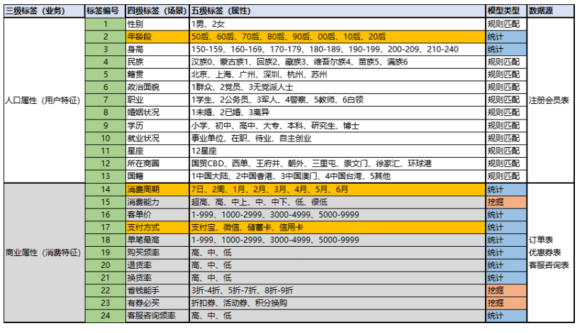

**统计型标签**

统计型标签是需要使用聚合函数计算后得到标签，比如最近3个月的退单率，用户最常用的支付方式等等，主要开发三个统计类型标签：

~~~scala
1）、标签：年龄段
标签属性：50后、60后、70后、80后、90后、00后、10后、20后
数据来源：注册会员表
2）、标签：消费周期
标签属性：7日、2周、1月、2月、3月、4月、5月、6月
据来源：订单表
3）、标签：支付方式
标签属性：支付宝、微信、储蓄卡、信用卡
据来源：订单表
~~~

**统计类型标签与规则匹配类型标签区别**

~~~python
# 规则匹配型标签，按照字段关联
  依据业务字段的值，获取对应的标签值（tagName）
  基本上不涉及计算
# 统计类型标签，需要对业务的数据计算，在获取对应标签值（tagName）
  例如： count/max/min,在....之间，大于、小于等等
~~~

在构建用户画像时，其中用户年龄段非常重要，无论是数据表表分析，还是精准营销与个性推荐，往往需要依据用户的年龄段进行相关的营销与推荐，如下展示了某母婴社群依据年龄和性别分析报表案例：

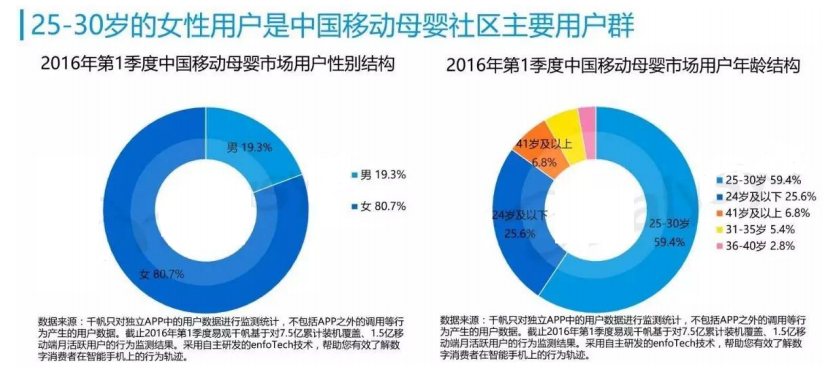

在标签管理平台新建对应的标签（业务标签和属性标签），编写标签模型，继承标签模板基类AbastractModel,实现其中标签计算的方法doTag。

**新建业务标签**

新建 业务（4级）标签 ： 年龄段标签 ，相关字段信息如下

~~~shell
标签名称：年龄段
标签分类：电商-某商城-人口属性
更新周期：
业务含义：注册用户的年龄段
标签规则：
inType=hbase
zkHosts=bigdata-cdh01.itcast.cn
zkPort=2181
hbaseTable=tbl_tag_users
family=detail
selectFieldNames=id,birthday
程序入口：
cn.itcast.tags.models.statistics.AgeRangeModel
算法名称：
STATISTICS
算法引擎：
tags-model_2.11.jar
模型参数：
--driver-memory 512m --executor-memory 512m --num-executors 1 --
executor-cores 1
~~~


**新建属性标签**

新建属性（5级）标签： 年龄段标签，相关字段信息如下：

~~~python
1）、属性值【50后】
标签名称：50后
标签含义：注册会员出生日期为1950年-1959年区间的
标签规则：19500101-19591231
2）、属性值【60后】
标签名称：60后
标签含义：注册会员出生日期为1960年-1969年区间的
标签规则：19600101-19691231
3）、属性值【70后】
标签名称：70后
标签含义：注册会员出生日期为1970年-1979年区间的
标签规则：19700101-19791231
4）、属性值【80后】
标签名称：80后
标签插入SQL语句：
标签含义：注册会员出生日期为1980年-1989年区间的
标签规则：19800101-19891231
5）、属性值【90后】
标签名称：90后
标签含义：注册会员出生日期为1990年-1999年区间的
标签规则：19900101-19991231
6）、属性值【00后】
标签名称：00后
标签含义：注册会员出生日期为2000年-2009年区间的
标签规则：20000101-20091231
7）、属性值【10后】
标签名称：10后
标签含义：注册会员出生日期为2010年-2019年区间的
标签规则：20100101-20191231
8）、属性值【20后】
标签名称：20后
标签含义：注册会员出生日期为2020年-2029年区间的
标签规则：20200101-20291231
~~~

标签插入SQL语句：

~~~mysql
INSERT INTO `tbl_basic_tag` VALUES ('338', '年龄段', null,
'inType=hbase\nzkHosts=bigdatacdh01.itcast.cn\nzkPort=2181\nhbaseTable=tbl_tag_users\nfamily=detail\nsele
ctFieldNames=id,birthday', null, '4', '314', '2019-12-20 17:06:48', '2019-
12-20 17:06:48', null, null);
INSERT INTO `tbl_basic_tag` VALUES ('339', '50后', null, '19500101-
19591231', null, '5', '338', '2019-12-20 17:11:23', '2019-12-20 17:11:23',
null, null);
INSERT INTO `tbl_basic_tag` VALUES ('340', '60后', null, '19600101-
19691231', null, '5', '338', '2019-12-20 17:11:38', '2019-12-20 17:11:38',
null, null);
INSERT INTO `tbl_basic_tag` VALUES ('341', '70后', null, '19700101-
19791231', null, '5', '338', '2019-12-20 17:12:54', '2019-12-20 17:12:54',
null, null);
INSERT INTO `tbl_basic_tag` VALUES ('342', '80后', null, '19800101-
19891231', null, '5', '338', '2019-12-20 17:13:08', '2019-12-20 17:13:08',
null, null);
INSERT INTO `tbl_basic_tag` VALUES ('343', '90后', null, '19900101-
19991231', null, '5', '338', '2019-12-20 17:13:22', '2019-12-20 17:13:22',
null, null);
INSERT INTO `tbl_basic_tag` VALUES ('344', '00后', null, '20000101-
20091231', null, '5', '338', '2019-12-20 17:13:38', '2019-12-20 17:13:38',
null, null);
INSERT INTO `tbl_basic_tag` VALUES ('345', '10后', null, '20100101-
20191231', null, '5', '338', '2019-12-20 17:13:54', '2019-12-20 17:13:54',
null, null);
INSERT INTO `tbl_basic_tag` VALUES ('346', '20后', null, '20200101-
20291231', null, '5', '338', '2019-12-20 17:13:54', '2019-12-20 17:13:54',
null, null);
INSERT INTO `tbl_model` VALUES ('7', '338', 'Statistics',
'cn.itcast.tags.models.statistics.AgeRangeModel', 'hdfs://bigdatacdh01.itcast.cn:8020/apps/temp/jars/499e0416-da3d-496c-8a32-
994109918c17.jar', '0,2019-12-20 08:00:00,2029-12-20 08:00:00', '2019-12-20
17:06:48', '2019-12-20 17:06:48', '4', '--driver-memory 512m --executormemory 512m --num-executors 1 --executor-cores 1');
~~~

**标签模型分析**

~~~scala
/*
338 国籍
属性标签数据：
339 50后 19500101-19591231
340 60后 19600101-19691231
341 70后 19700101-19791231
342 80后 19800101-19891231
343 90后 19900101-19991231
344 00后 20000101-20091231
345 10后 20100101-20191231
346 20后 20200101-20291231
业务数据：
99 column=detail:birthday, value=1982-01-11 -> 19820111
分析思路：
比较birthday日期 在 某个年龄段之内，给予标签值（tagName）
19820111 -> 80后
实现：JOIN，UDF函数
*/
~~~

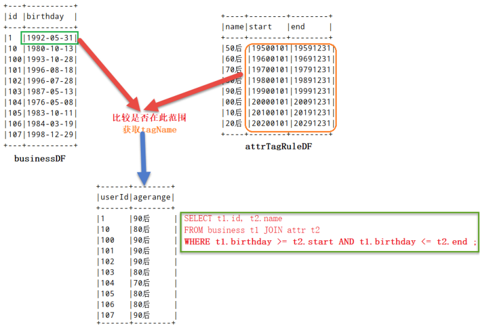

使用dataFrame中DSL编程，涉及到两个函数处理，说明如下：

~~~scala
// 函数：正则替换
/**
* Replace all substrings of the specified string value that match regexp
with rep.
*
* @group string_funcs
* @since 1.5.0
*/
def regexp_replace(e: Column, pattern: String, replacement: String):
Column
// 函数：在。。。范围之内
/**
* True if the current column is between the lower bound and upper bound,
inclusive.
*
* @group java_expr_ops
* @since 1.4.0
*/
def between(lowerBound: Any, upperBound: Any): Column = {
(this >= lowerBound) && (this <= upperBound)
}
~~~

### 标签模型：消费周期

> 消费周期 主要是获取用户在平台的最近消费时间，比如用户最后一次的消费时间是最近一周还是一个月，方便获取到长时间未消费的用户。

在标签管理平台新建对应的标签（业务标签、属性标签），编写标签模型类，继承标签模型基类AbstactModel，实现其中标签计算的方法doTag，业务字段为finishtime,订单完成时间。

~~~mysql
select memberId,finshTime From tags_dat.tbl_tag_orders limit 5;
~~~

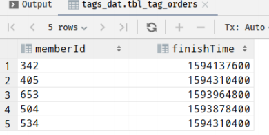

**新建业务标签**

新建业务标签（4级）标签：消费周期标签，相关字段信息如下：

~~~shell
标签名称：消费周期
标签分类：电商-某商城-商业属性
更新周期：7天
业务含义：用户的消费周期：7日、2周、1月、2月、3月、4月、5月、6月
标签规则：
inType=hbase
zkHosts=bigdata-cdh01.itcast.cn
zkPort=2181
hbaseTable=tbl_tag_orders
family=detail
selectFieldNames=memberid,finishtime
程序入口：
cn.itcast.tags.models.statistics.ConsumeCycleModel
算法名称：
STATISTICS
算法引擎：
tags-model_2.11.jar
模型参数：
--driver-memory 512m --executor-memory 512m --num-executors 1 --
executor-cores 1
~~~

**新建属性（5级）标签**

新建属性标签：7日，2周，1月，2月，3月，4月，5月，6月，相关字段信息如下：

~~~python
1）、属性值【近7天】
标签名称：近7天
标签含义：消费周期是近7日
标签规则：0-7
2）、属性值【近2周】
标签名称：近2周
标签含义：消费周期是近2周
标签规则：8-14
3）、属性值【近1月】
标签名称：近1月
标签含义：消费周期是近1月
标签规则：15-30
4）、属性值【近2月】
标签名称：近2月
标签含义：消费周期是近60天
标签规则：31-60
5）、属性值【近3月】
标签名称：近3月
标签含义：消费周期是近90天
标签规则：61-90
6）、属性值【近4月】
标签名称：近4月
标签含义：消费周期是近120天
标签规则：91-120
7）、属性值【近5月】
标签名称：近5月
标签含义：消费周期是近150天
标签规则：121-150
8）、属性值【近半年】
标签名称：近半年
标签含义：消费周期是近半年
标签规则：151-180
~~~

属性标签数据插入【tbl_basic_tag】

~~~MYSQL
INSERT INTO `tbl_basic_tag` VALUES ('347', '消费周期', null,
'inType=hbase\nzkHosts=bigdatacdh01.itcast.cn\nzkPort=2181\nhbaseTable=tbl_tag_orders\nfamily=detail\nsel
ectFieldNames=memberid,finishtime', null, '4', '315', '2019-12-20
17:16:24', '2019-12-20 17:16:24', null, null);
INSERT INTO `tbl_basic_tag` VALUES ('348', '近7天', null, '0-7', null, '5',
'347', '2019-12-20 17:17:17', '2019-12-20 17:17:17', null, null);
INSERT INTO `tbl_basic_tag` VALUES ('349', '近2周', null, '8-14', null,
'5', '347', '2019-12-20 17:17:44', '2019-12-20 17:17:44', null, null);
INSERT INTO `tbl_basic_tag` VALUES ('350', '近1月', null, '15-30', null,
'5', '347', '2019-12-20 17:17:55', '2019-12-20 17:17:55', null, null);
INSERT INTO `tbl_basic_tag` VALUES ('351', '近2月', null, '31-60', null,
'5', '347', '2019-12-20 17:18:11', '2019-12-20 17:18:11', null, null);
INSERT INTO `tbl_basic_tag` VALUES ('352', '近3月', null, '61-90', null,
'5', '347', '2019-12-20 17:18:23', '2019-12-20 17:18:23', null, null);
INSERT INTO `tbl_basic_tag` VALUES ('353', '近4月', null, '91-120', null,
'5', '347', '2019-12-20 17:18:33', '2019-12-20 17:18:33', null, null);
INSERT INTO `tbl_basic_tag` VALUES ('354', '近5月', null, '121-150', null,
'5', '347', '2019-12-20 17:18:47', '2019-12-20 17:18:47', null, null);
INSERT INTO `tbl_basic_tag` VALUES ('355', '近半年', null, '151-180', null,
'5', '347', '2019-12-20 17:18:47', '2019-12-20 17:18:47', null, null);
INSERT INTO `tbl_model` VALUES ('8', '347', 'Statistics',
'cn.itcast.tags.models.statistics.ConsumeCycleModel', 'hdfs://bigdatacdh01.itcast.cn:8020/apps/temp/jars/ea4b2ff8-455d-44c1-9c41-
8c256c0f5730.jar', '2,2019-12-20 08:00:00,2029-12-20 08:00:00', '2019-12-20
17:16:24', '2019-12-20 17:16:24', '4', '--driver-memory 512m --executormemory 512m --num-executors 1 --executor-cores 1');
~~~

**業務思路分析**

~~~scala
1）、获取每个会员最近一个订单完成时间
按照memberid分组，获取finishtime最大值，使用max函数
2）、转换订单完成时间数据格式
1589817600 转换为日期格式（yyyy-MM-dd HH:mm:ss），使用from_unixtime函数
def from_unixtime(ut: Column): Column = withExpr {
FromUnixTime(ut.expr, Literal("yyyy-MM-dd HH:mm:ss"))
}
def from_unixtime(ut: Column, f: String): Column = withExpr {
FromUnixTime(ut.expr, Literal(f))
}
3）、计算当前日期与订单完成期相差天数
使用函数：datediff
/**
* Returns the number of days from `start` to `end`.
* @group datetime_funcs
* @since 1.5.0
*/
def datediff(end: Column, start: Column): Column = withExpr {
DateDiff(end.expr, start.expr)
}
4）、获取当前时间
使用函数：current_timestamp()、current_date()
/**
* Returns the current timestamp as a timestamp column.
*
* @group datetime_funcs
* @since 1.5.0
*/
def current_timestamp(): Column = withExpr { CurrentTimestamp() }
~~~

### 标签模型： 支付方式

> 用户的支付方式有很多种，比如支付宝、微信、货到付款、银联等等，需要知道用户最常用的支付方式，以便于了解用户最常用的支付平台。

在标签管理平台新建对应的标签（业务标签和属性标签），编写标签模型类，继承标签模型基类AbstactModel,实现其中标签的计算方法doTag.

**业务字段调研**

在mysql数据中，查看业务数据【订单表 tbl_tag_orders】中支付相关字段【paymentCode/paymentName】,编写sql看看有那些值，便于标签开发。

~~~mysql
-- 查看MySQL数据库中订单表tags_dat.tbl_tag_orders
SELECT paymentCode, paymentName from tags_dat.tbl_tag_orders limit 10 ;
/*
+-------------+-------------+
| paymentCode | paymentName |
+-------------+-------------+
| alipay | 支付宝 |
| alipay | 支付宝 |
| alipay | 支付宝 |
| cod | 货到付款 |
| cod | 货到付款 |
| alipay | 支付宝 |
| alipay | 支付宝 |
| alipay | 支付宝 |
| alipay | 支付宝 |
| alipay | 支付宝 |
+-------------+-------------+
*/
-- 查看支付编码和支付名称
SELECT paymentCode, paymentName, COUNT(1) AS cnt from
tags_dat.tbl_tag_orders GROUP BY paymentCode, paymentName;
/*
+-------------+-------------+-------+
| paymentCode | paymentName | cnt |
+-------------+-------------+-------+
| alipay | 支付宝 | 96425 |
| chinapay | 银联支付 | 4068 |
| cod | 货到付款 | 16832 |
| wxpay | 微信支付 | 2800 |
+-------------+-------------+-------+
*/
-- SELECT paymentCode, paymentName, COUNT(1) AS cnt from
tags_dat.tbl_orders GROUP BY paymentCode, paymentName;
-- 查看支付方式
SELECT paymentCode, COUNT(1) AS cnt from tags_dat.tbl_tag_orders GROUP BY
paymentCode;
/*
+-------------+-------+
| paymentCode | cnt |
+-------------+-------+
| alipay | 96425 |
| chinapay | 4068 |
| cod | 16832 |
| wxpay | 2800 |
+-------------+-------+
*/
-- SELECT paymentCode, COUNT(1) AS cnt from tags_dat.tbl_orders GROUP BY
paymentCode;
~~~

**新建业务标签**

新建业务标签（4级）标签：支付方式标签，相关字段信息如下：

~~~scala
标签名称：支付方式
标签分类：电商-某商城-商业属性
更新周期：1天
业务含义：用户订单的支付方式：支付宝、微信支付、银联支付、货到付款
标签规则：
inType=hbase
zkHosts=bigdata-cdh01.itcast.cn
zkPort=2181
hbaseTable=tbl_tag_orders
family=detail
selectFieldNames=memberid,paymentcode
程序入口：
cn.itcast.tags.models.statistics.PayTypeModel
算法名称：
STATISTICS
算法引擎：
tags-model_2.11.jar
模型参数：
--driver-memory 512m --executor-memory 512m --num-executors 1 --
executor-cores 1
~~~

**新建属性标签**

新建属性标签（5级）标签：支付宝，微信支付、银联支付、货到付款、相关字段信息如下：

~~~scala
1）、属性值【支付宝】
标签名称：支付宝
标签含义：喜欢用支付宝付款
标签规则：alipay
2）、属性值【微信支付】
标签名称：微信支付
标签含义：喜欢用微信付款
标签规则：wxpay
3）、属性值【银联支付】
标签名称：银联支付
标签含义：喜欢用银联付款
标签规则：chinapay
4）、属性值【货到付款】
标签名称：货到付款
标签含义：喜欢货到付款
标签规则：cod
~~~

属性标签插入【tal_basic_tag】:

~~~mysql
INSERT INTO `tbl_basic_tag` VALUES ('356', '支付方式', null,
'inType=hbase\nzkHosts=bigdatacdh01.itcast.cn\nzkPort=2181\nhbaseTable=tbl_tag_orders\nfamily=detail\nsele
ctFieldNames=memberid,paymentcode', null, '4', '315', '2019-12-20 17:26:23',
'2019-12-20 17:26:23', null, null);
INSERT INTO `tbl_basic_tag` VALUES ('357', '支付宝', null, 'alipay', null,
'5', '356', '2019-12-20 17:26:50', '2019-12-20 17:26:50', null, null);
INSERT INTO `tbl_basic_tag` VALUES ('358', '微信支付', null, 'wxpay', null,
'5', '356', '2019-12-20 17:27:04', '2019-12-20 17:27:04', null, null);
INSERT INTO `tbl_basic_tag` VALUES ('359', '银联支付', null, 'chinapay',
null, '5', '356', '2019-12-20 17:27:17', '2019-12-20 17:27:17', null, null);
INSERT INTO `tbl_basic_tag` VALUES ('360', '货到付款', null, 'cod', null,
'5', '356', '2019-12-20 17:27:32', '2019-12-20 17:27:32', null, null);
INSERT INTO `tbl_model` VALUES ('9', '356', 'Statistics',
'cn.itcast.tags.models.statistics.PayTypeModel', 'hdfs://bigdatacdh01.itcast.cn:8020/apps/temp/jars/cbcbe36a-2808-47e2-b476-
bec0b319c6c3.jar', '1,2019-12-20 08:00:00,2029-12-20 08:00:00', '2019-12-20
17:26:23', '2019-12-20 17:26:23', '4', '--driver-memory 512m --executormemory 512m --num-executors 1 --executor-cores 1');
~~~

**标签模型开发**

继承基类AbstactModel，实现标签计算方法doTag,涉及到订单表数据中字段值：

~~~python
10 column=detail:memberid, timestamp=1574240145469, value=13823431
10 column=detail:paymentcode, timestamp=1574240145469, value=alipay
~~~

DataSet/DataFrame中添加列函数withColumn，如果列存在就替换值，不存在创建新列：

~~~python
/**
* Returns a new Dataset by adding a column or replacing the existing
column
* that has the same name.
*
* @group untypedrel
* @since 2.0.0
*/
def withColumn(colName: String, col: Column): DataFrame
~~~

在DSL编程中窗口函数成都窗口设置使用window类，封装如下：

~~~scala
val window = Window
.partitionBy($"") // 分区字段设置
.orderBy($"".asc, $"".desc) // 排序字段及规则设置
val window = Window
.distributeBy($"") // 分区字段设置
.orderBy($"".asc, $"".desc) // 排序字段及规则设置
~~~

**开窗函数使用**

* sql实现

  ~~~mysql
  spark.sql(
  """
  |WITH tmp AS (
  |SELECT
  | *,
  | ROW_NUMBER() OVER(PARTITION BY deptno ORDER BY sal DESC)
  AS rnk
  |FROM
  | view_tmp_emp
  |)
  |SELECT
  | t.empno, t.ename, t.sal, t.deptno
  |FROM tmp t
  |WHERE t.rnk = 1
  |""".stripMargin)
  .show()
  ~~~

* DSL编程实现

  ~~~scala
  empDF
  // 使用函数，增加一列
  withColumn(
  "rnk", //
  row_number().over(
  Window.partitionBy($"deptno").orderBy($"sal".desc)
  )
  )
  // 获取rnk=1
  .where($"rnk" === 1)
  .select($"empno", $"ename", $"sal", $"deptno")
  .show()
  ~~~


----------

## 挖掘标签模型开发及构建算法模型

### 机器学习

机器学习是人工智能的一个分支，使用计算机设计一个系统，使她能够根据训练数据按照一定的方式来学习；随着训练次数的增加，该系统可以在性能上不断学习和改进。通过参数优化学习模型，能够用于预测相关的问题的输出。

> [训练] -> [调优] -> [预测]

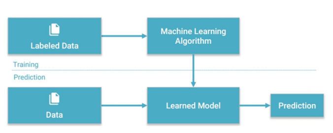

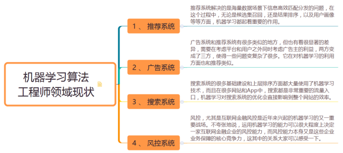

**基本概念**

机器学习是数据通过算法构建出模型并对模型进行评估，评估的性能如果能达到要求，就安这个模型测试其他的模型，如果达不到就要调整算法来重新建立模型，再次进行评估，如此循环反复，最终获满意的经验来处理其他数据。

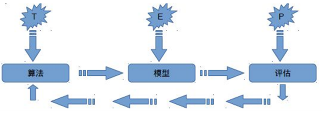

机器学习更多的表现是，根据【已有的数据】，选用【合适的算法】，【训练模型】，预测未来。

**机器学习分类**

从某种程度来说，可以将机器学习分为三类：

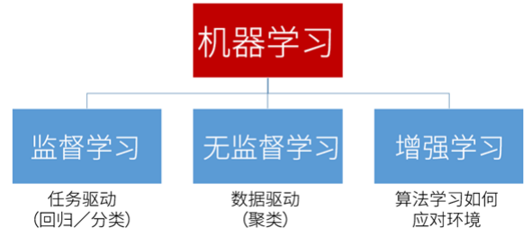

* **监督学习**：用已知某种或者某些特性的样本作为训练集，以建立一个数学模型，再用已经建立的模型来预未知的样本。此种方法称为监督学习，是最常的机器学习方法，是从标签化训练数据集中推断出函数的机器学习任务。

  ~~~ python
  数据集：
  特征features + 标签label/目标target
  ~~~

  其一、分类

  将数据映射到预先定义的群组或者类。算法要求基于数据属性来定义类别，把具有某些特征的数据项映射到给定的某个类别上。

  其二、回归

  用属性的历史数据预测未来趋势，算法首先假设一些已知类型的函数可以拟合目标数据，然后利用某种误差分析确定一个与目标数据拟合程度最好的函数。

  分类模型处理表示类别的离散变量，而回归模型则处理可以取得任意实数的目标变量，都是通过确定一个模型，将输入特征映射到预测的输出。

* **无监督学习**：与监督学习相比，无监督学习的训练集没有人为的标注结果，而非监督式学习转给你，数据并不被特别的标识，学习模型是为了推断出数据的一些内在的结构。

  > 数据集：
  >
  >   只有特征features

  实际应用中，无监督的例子非常常见，原因是在许多真实的场景中，标注数据的获取非常困难，代价非常大（比如人工为分类模型标注训练数据）。通常，无监督学习会和监督模型相结合，比如使用无监督计数为监督模型生成输入数据，无监督学习方法发挥做的情形。

  在很多情况下，聚类模型等价于分类模型的无监督形式。在聚类中，把数据分割，这样每个数据的样本就会属于某个部分。称为类簇。类簇相当于类别，只不过不知道真实的类别。

  

  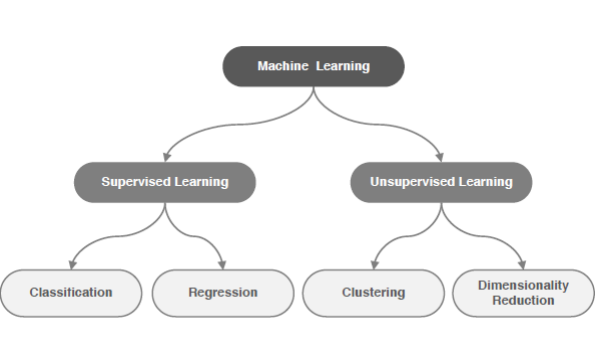

  **基本思路**

  机器学习的基本思路，如下三个步骤：

  ~~~shell
  1、把现实生活的问题抽象成数学模型，并且很清楚模型中不同参数的作用
  2、利用数学方法对这个数学模型进行求解，从而解决现实生活中的问题。
  3、评估这个数学模型，是否真正的解决了现实生活中的问题，解决如何
  ~~~

  无论使用什么算法，使用什么样的数据，最根本的思路都逃出不出上面三步。

  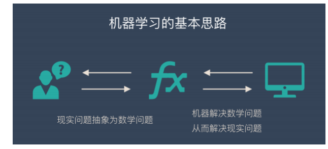

机器学习在实际的操作转给你，一共分为7步：

1、收集数据

2、根据模型【特征工程】

3、选择一个模型

4、训练

5、评估

6、参数调整

7、预测（开始使用）


**机器学习核心**

数据 + 算法 。两者缺一不可。

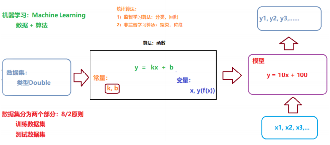

**机器学习三要素**

使用机器学习库时候，三要素：算法、模型、策略

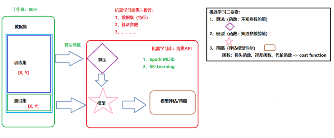

机器学习调优：

1）数据集（特征如何处理）

2）算法参数

3）集成算法（RF/GBT）

**Spark ML 机器学习库**

在spark MLlib 机器学习库提供两套算法实现的api:基于RDD API 和 基于DataFrame API.

* 分类

  逻辑回归

  贝叶斯

  支持向量机

* 聚类

  k-均值

* 推荐

  交替最小二乘法

* 回归

  线性回归

* 树

  决策树

  随机森林

用户画像标签模型开发中，均使用基于DateFrameAPI 开发算法库。

~~~python
1）、DataFrame: This ML API uses DataFrame from Spark SQL as an ML dataset,
which can hold a variety of data types. E.g., a DataFrame could have
different columns storing text, feature vectors, true labels, and
predictions.
# 一种数据结构，来源于SparkSQL中，DataFrame = Dataset[Row]，存储要训练的和测试的
数据集；
2）、Transformer: A Transformer is an algorithm which can transform one
DataFrame into another DataFrame. E.g., an ML model is a Transformer which
transforms a DataFrame with features into a DataFrame with predictions.
转换器，一种算法Algorithm，必须实现transform方法。比如：模型Model就是一个转换
器，将 输入的数据集DataFrame，转换为预测结果的数据集DataFrame；
3）、Estimator: An Estimator is an algorithm which can be fit on a
DataFrame to produce a Transformer. E.g., a learning algorithm is an
Estimator which trains on a DataFrame and produces a model.
估计器或者模型学习器，将数据集DataFrame转换为一个Transformer，实现 fit() 方法，
输入一个 DataFrame 并产生一个 Model，即一个 Transformer（转换器）；
4）、Parameter: All Transformers and Estimators now share a common API for
specifying parameters.
参数，无论是转换器Transformer 还是模型学习器Estimator都是一个算法，使用算法的时候
必然有参数。
~~~

数据转换为特征features，过程称之为特征工程（特征提取、特征转换、特征选择）

~~~python
1）、特征转换
http://spark.apache.org/docs/2.2.0/ml-features.html#featuretransformers
2）、特征选择
http://spark.apache.org/docs/2.2.0/ml-features.html#feature-selectors
3）、特征提取
主要针对文本数据特征的提取（NLP）
http://spark.apache.org/docs/2.2.0/ml-features.html#feature-extractors
在Spark 2.4版本中提供针对图像数据特征的提取
http://spark.apache.org/docs/2.4.0/ml-datasource
spark.read
.format("image")
.option("dropInvalid", true)
.load("data/mllib/images/origin/kittens")
~~~


### 客户价值模型： RFM


**RFM 模型引入**

比如电商网站要做一次营销活动，需要针对不同价值的客户群体进行分群，对于高价值的用户推荐手表、珠宝等高端商品，对于低价值用户推荐促销的廉价商品，当然有如下的问题要思考：

~~~scala
1、谁是最佳客户？
2、谁即将要成为流失客户？
3、谁将有潜力成为有价值的客户
4、哪些客户能够留存？
5、哪些客户会对目前的活动有所反应？
~~~

> 在传统企业和电商众多的客户细分模型中，RFM模型是被广泛提到和使用的。
>
> RFM 模型是衡量当前用户价值和客户潜在价值的重要工具和手段

RFM 是 ： Rencency(最近一次消费)、Frequency(消费频率)、Monetary(消费金额)，三个指标首字母组合，如下图示:

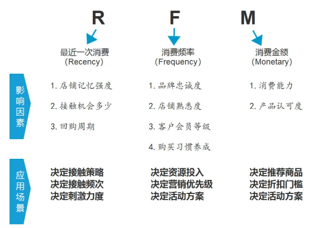

~~~scala
1、最近购买的时间越近，用户对产品促销互动越大
R 越小越好
2、客户购买的频率越高，客户就品牌的满意度就越大
F 越大越好
3、货币价值（购买金额）将高消费客户和低消费客户区分开来
M 越大越好，区别高低消费用户
~~~

根据RFM模型（业务数据：订单数据，时间范围内订单数据），就可以统计在某一段时间内，用户最近的消费间隔，消费次数和消费金额，再根据使用 K-Means算法对用户进行聚类分群 （不仅仅可以局限于这三个数据字段，还可以根据业务需求，加入其他字段，进行调整模型）：

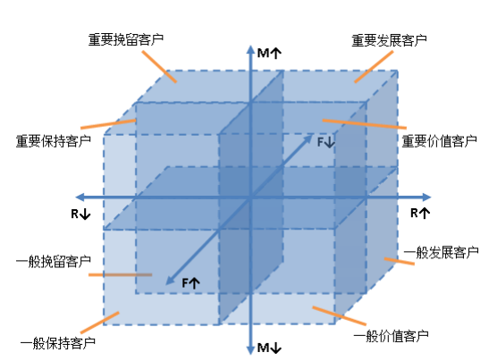

~~~scala
对最近一个月内所有用户订单数据进行统计RFM值：
按照memberId分组：
R: max(finishtime)，距离当前天数
F：count(orderId)
M: sum(orderAmt)
使用聚合函数：
groupBy分组，max\count\sum函数聚合，其中使用日期处理函数
~~~

**RFM 模型**

指标：

~~~python
1）、R(Recency)表示客户最近一次购买的时间有多远
2）、F(Frequency)表示客户在最近一段时间内购买的次数
3）、M (Monetary) 表示客户在最近一段时间内购买的金额
~~~

在RFM模式中，一般的分析型CRM着重在对于客户贡献度的分析，RFM则强调以客户的行为来区分客户。

* R:最近一次消费【Recency】

  消费指的是 客户在店铺消费最近一次和上一次的时间间隔 ，理论上R值越小的客户是价值越高的客户，即对店铺的回购几次最有可能产生回应。

  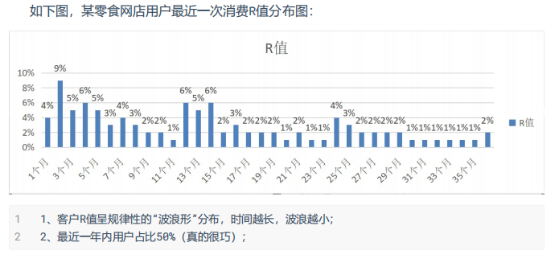

* F:消费频次【Frequency】

  消费频率是 客户在固定时间内的购买次数（一般是1年） 。但是如果实操中实际店铺由于受品类宽度的原因，比如卖3C产品，耐用品等即使是忠实粉丝用户也很难在1年内购买多次。所以，有些店铺在运营RFM模型时，会把F值的时间范围去掉，替换成累计购买次数。

  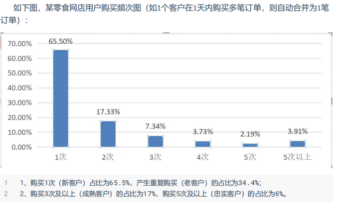

* M:消费金额【monetary】

M值是RFM模型中相对于R值和F值最难使用，但最具有价值的指标。大家熟知的“二八定律”（又名“帕雷托法则”）曾作出过这样的解释： 公司80%的收入来自于20%的用户

~~~python
理论上M值和F值是一样的，都带有时间范围，指的是一段时间（通常是1年）内的消费金额，在实
际项目中认为对于一般店铺的类目而言，产品的价格带都是比较单一的，比如：同一品牌美妆类，价格
浮动范围基本在某个特定消费群的可接受范围内，加上单一品类购买频次不高，所以对于一般店铺而
言，M值对客户细分的作用相对较弱。
~~~

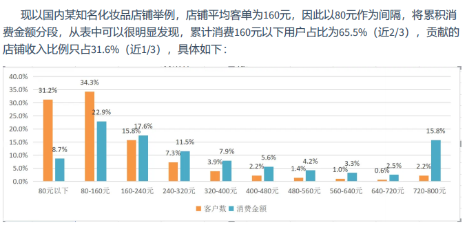

**RFM实践应用**

有两种方法来分析RFM模型的结果：用基于RFM模型的 划分标准 来进行客户细分，用基于
RFM模型的 客户评分 来进行客户细分。

客户细分：

选择RFM模型中的1-3个指标进行客户细分，如下表所示。切记细分指标需要在自己可操控的合理范围内，并非越多越好，一旦用户细分群组过多，一来会给自己的营销方案执行带来较大的难度，而来可能会遗漏用户群或者对同个用户造成多次打扰。

> 最终选择多少个指标有两个客户基数，店铺的商品的客户结构。
>
> 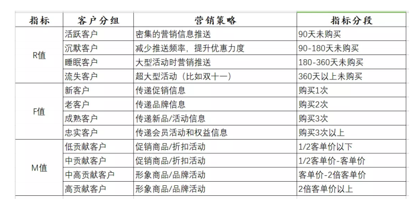

目标用户：

除了直接用RFM模型对用户进行分组之外，还有一种常见的方法是 利用RFM模型的三个属性对客户进行打分，通过打分确定每个用户的质量，最终筛选出自己的目标用户 。

~~~python
RFM模型评分主要有三个部分：
1、确定RFM三个指标的分段和每个分段的分值；
2、计算每个客户RFM三个指标的得分；
3、计算每个客户的总得分，并且根据总得分筛选出优质的客户
~~~

比如，实操的过程中一般每个指标分为3-5段，其中R值可以根据开店以来的时间和产品的回购周期来判定，F值根据现有店铺的平均购买频次，M值可参考上文客单价的分段指标。举个例子：

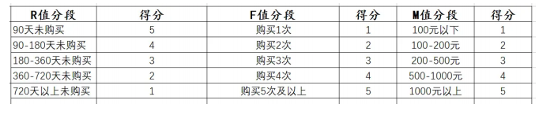

确认RFM的分段和对应分段的分值之后，就可以按照用户情况对应进行打分。

**RFM计算**

如何依据RFM模型针对用户订单数据进行计算操作呢，具体分析如下所示

R-F-M分别按照5、4、3、2、1进行赋值，分别给出R_Score、F_Score、M_Score ：

~~~python
R 按照数值递减排列，按数值区间依次分别赋值5,4,3,2,1
递减
F 按照数值递增排列，按数值区间依次分别赋值5,4,3,2,1
递增
M 按照数值递减排列，按数值区间依次分别赋值5,4,3,2,1
递增
按照规则，给RFM值打分Score
R: 1-3天=5分，4-6天=4分，7-9天=3分，10-15天=2分，大于16天=1分
F: ≥200=5分，150-199=4分，100-149=3分，50-99=2分，1-49=1分
M: ≥20w=5分，10-19w=4分，5-9w=3分，1-4w=2分，<1w=1分
举例说明：
zhangsan:
R: 1 F: 4 M: 4
lisi:
R: 4 F: 1 M: 4
上述的两个用户发现RFM_SCORE值之和相同的，但是属于不同价值用户
~~~

用户分层：

按照R_Score、F_Score、M_Score进行 用户聚类 ，采用方法为K-Means，共分8类（具体分为几类，依据实际业务情况而定），并给RFM赋予权重（目前 权重采用R:F:M =0.25:0.25:0.5 ），计算各类的用户价值。

~~~python
业务流程：
1）、计算每个用户RFM值
2）、按照规则给RFM打分
3）、使用KMeans算法聚类分组，划分客户群体
~~~

**k-Means算法**

k-Means是最常用的基于欧式距离的聚类算法，其认为两个目标的距离越近，相似度越大。

~~~
K-Means算法在线演示（4个簇）：
http://shabal.in/visuals/kmeans/3.html
Visualizing K-Means Clustering
https://www.naftaliharris.com/blog/visualizing-k-means-clustering/
~~~

