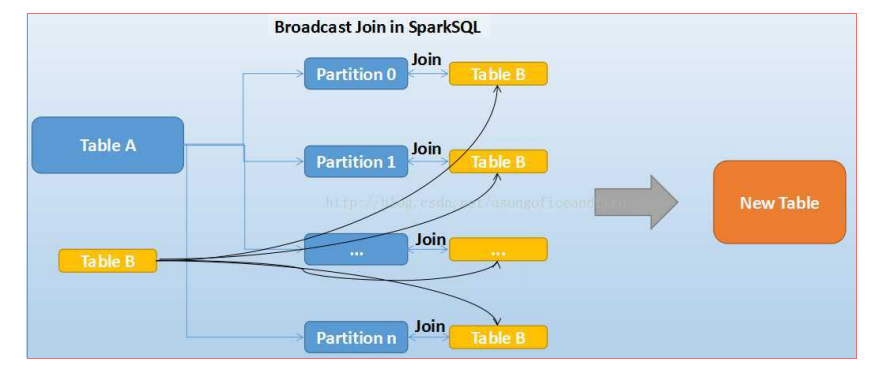
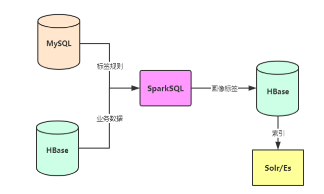
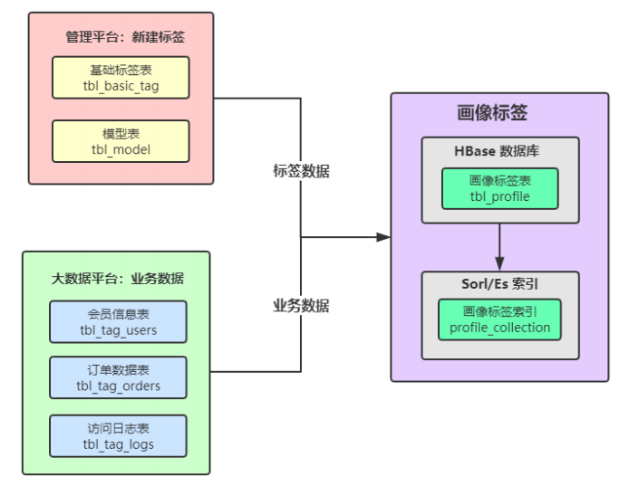
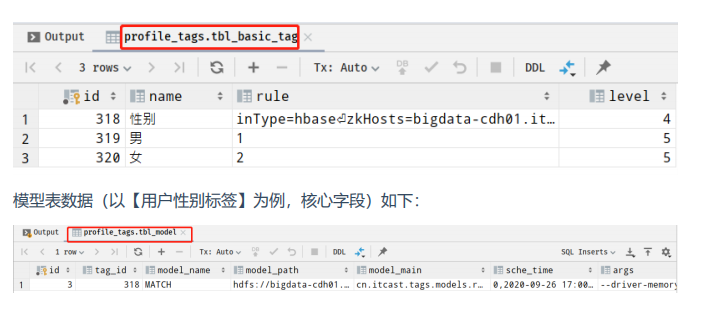
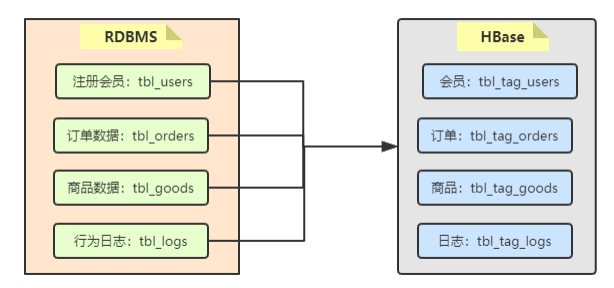
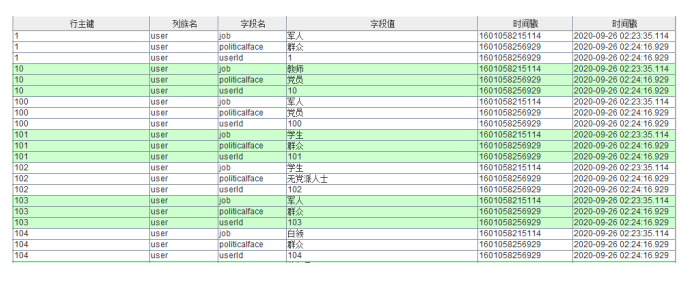
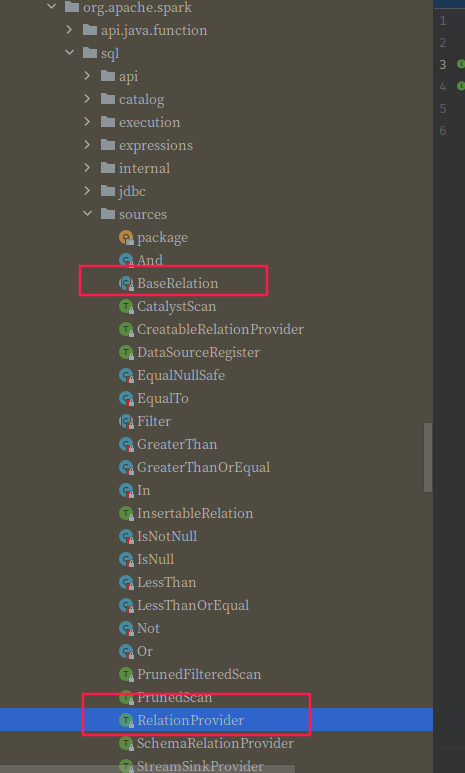
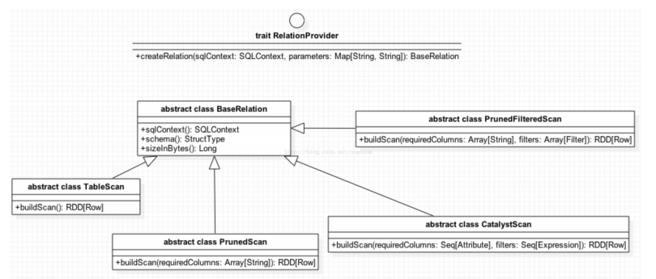
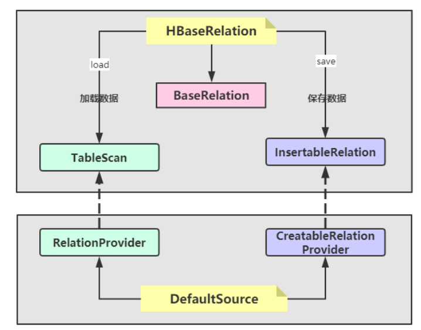

### 标签模型：用户性别标签

> 向以规则匹配中性别标签为例，开发整个标签模型，熟悉开发过程，对标签的构建整体认识，如下为管理平台首先需要新建标签

标签模型开发具体流程，数据流程详细图如下所示：

~~~ mysql
CREATE TABLE `tbl_basic_tag` (
`id` bigint(20) NOT NULL AUTO_INCREMENT,
`name` varchar(50) DEFAULT NULL COMMENT '标签名称',
`industry` varchar(30) DEFAULT NULL COMMENT '行业、子行业、业务类型、标签、属
性',
`rule` varchar(300) DEFAULT NULL COMMENT '标签规则',
`business` varchar(100) DEFAULT NULL COMMENT '业务描述',
`level` int(11) DEFAULT NULL COMMENT '标签等级',
`pid` bigint(20) DEFAULT NULL COMMENT '父标签ID',
`ctime` datetime DEFAULT NULL COMMENT '创建时间',
`utime` datetime DEFAULT NULL COMMENT '修改时间',
`state` int(11) DEFAULT NULL COMMENT '状态：1申请中、2开发中、3开发完成、4已上
线、5已下线、6已禁用',
`remark` varchar(100) DEFAULT NULL COMMENT '备注',
PRIMARY KEY (`id`)
) ENGINE=InnoDB AUTO_INCREMENT=307 DEFAULT CHARSET=utf8 COMMENT='基础标签
表';

CREATE TABLE `tbl_model` (
`id` bigint(20) NOT NULL AUTO_INCREMENT,
`tag_id` bigint(20) DEFAULT NULL,
`model_name` varchar(200) DEFAULT NULL,
`model_main` varchar(200) DEFAULT NULL,
`model_path` varchar(200) DEFAULT NULL,
`sche_time` varchar(200) DEFAULT NULL,
`ctime` datetime DEFAULT NULL,
`utime` datetime DEFAULT NULL,
`state` int(11) DEFAULT NULL,
`args` varchar(100) DEFAULT NULL,
PRIMARY KEY (`id`)
) ENGINE=InnoDB AUTO_INCREMENT=2 DEFAULT CHARSET=utf8;

-- 1、基础标签tbl_basic_tag
INSERT INTO `tbl_basic_tag` VALUES ('318', '性别', null,
'inType=hbase\nzkHosts=bigdatacdh01.itcast.cn\nzkPort=2181\nhbaseTable=tbl_tag_users\nfamily=detail\nselec
tFieldNames=id,gender', null, '4', '314', '2019-12-03 11:11:54', '2019-12-03
11:11:54', null, null);
INSERT INTO `tbl_basic_tag` VALUES ('319', '男', null, '1', null, '5',
'318', '2019-12-03 11:28:03', '2019-12-03 11:28:03', null, null);
INSERT INTO `tbl_basic_tag` VALUES ('320', '女', null, '2', null, '5',
'318', '2019-12-03 11:28:39', '2019-12-03 11:28:39', null, null);

-- 2、模型表tbl_model
INSERT INTO `tbl_model` VALUES ('1', '318', 'MATCH',
'cn.itcast.tags.models.rule.GenderModel', 'hdfs://bigdatacdh01.itcast.cn:8020/apps/temp/jars/9f0d015b-8535-4538-8722-
1d9a331069d1.jar', '4,2019-12-03 10:00:00,2029-12-03 10:00:00', '2019-12-03
11:11:54', '2019-12-03 11:11:54', '4', '--driver-memory 512m --executormemory 512m --num-executors 1 --executor-cores 1');
~~~

相关字段信息如下：

~~~ shell
标签名称：性别
标签分类：电商-某商城-人口属性
更新周期：
业务含义：注册会员的性别
标签规则：
inType=hbase
zkHosts=bigdata-cdh01.itcast.cn
zkPort=2181
hbaseTable=tbl_tag_users
family=detail
selectFieldNames=id,gender
程序入口：
cn.itcast.tags.models.rule.GenderModel
算法名称：
MATCH
算法引擎：
tags-model_2.11.jar
模型参数：
--driver-memory 512m --executor-memory 512m --num-executors 1 --
executor-cores 1
~~~

主要分为四个步骤：

~~~shell
// 1 依据TagId,从MySQL读取标签数据
// 2 解析标签rule,从HBase读取业务数据
// 3 业务数据结合标签属性数据，构建标签
// 4 画像标签数据存储HBase表
~~~

涉及技术核心点（难点）

~~~ shell
第一、如何从HBase表读取和写入数据
第二、标签匹配与标签合并
标签合并：将历史标签数据与计算标签数据进行合并
第三、基于DataFrame DSL开发
使用select,filter,groupBy,agg等函数，内置函数：functions._
~~~

标签数据读取

首先从基础标签表tbl_basic_tag 中读取性别相关的标签数据： 业务标签和属性标签。

依据业务标签ID读取标签相关的数据： 业务标签数据和对应属性标签数据，sql如下：

~~~mysql
(
SELECT `id`,
`name`,
`rule`,
`level`
FROM `profile_tags`.`tbl_basic_tag`
WHERE id = 318
UNION
SELECT `id`,
`name`,
`rule`,
`level`
FROM `profile_tags`.`tbl_basic_tag`
WHERE pid = 318
ORDER BY `level` ASC, `id` ASC
) AS basic_tag
~~~

查询结果如下： 

读取Hbase表的业务数据：

业务数据存储在HBase表中，此处采用TableInputFormt的方式读取数据，编写工具类，其中涉及如何将RDD转换为DataFrame。

构建标签：

依据获取的业务属性标签数据中的规则，进行关联匹配，构建每个用户的性别标签，如下图示：

### 标签模型：职业标签

在标签管理平台新建对应的标签（业务标签和属性标签），编写标签模型类，实现标签计算。

~~~mysql
`job` varchar(60) DEFAULT NULL COMMENT '职业；1学生、2公务员、3军人、4警察、5教
师、6白领'
-- SQL 语句
SELECT job, COUNT(1) AS cnt FROM tags_dat.tbl_users GROUP BY job ;
~~~

**新建标签**

新建业务（4级）标签：职业标签，相关字段信息如下：

~~~shell
标签名称：职业
标签分类：电商-某商城-人口属性
更新周期：
业务含义：注册用户的职业
标签规则：
inType=hbase
zkHosts=bigdata-cdh01.itcast.cn
zkPort=2181
hbaseTable=tbl_tag_users
family=detail
selectFieldNames=id,job
程序入口：
cn.itcast.tags.models.rule.JobModel
算法名称：
MATCH
算法引擎：
tags-model_2.11.jar
模型参数：
--driver-memory 512m --executor-memory 512m --num-executors 1 --
executor-cores 1
~~~

新建属性（5级）标签：1 学生、 2 公务员、3 军人、4 警察、5 教师、6 白领，相关字段信息

**模型开发**

在标签管理平台web新建标签，（业务标签4级标签和属性标签5级标签），参考用户性别标签模型修改其中标签的计算部分，使用UDF函数，完成标签匹配计算。

**优化项**
        对于开发规则规则匹配类型标签，用户性别标签和用户职业标签计算标签时，分别使用DataFrame Join 和 自定义UDF函数关联给咱，计算获取的对应标签ID.

​         因为Join操作对两个表key值相同额记录进行连接，在SparkSql中，对两个表做Join最直接的方式是先根据key分区，再在每个分区找那个把key值相同的记录拿出来做连接操作。但这样就不可避免地涉及shuffle,而shuffle在Spark是比较耗时的操作，应该尽可能的设计spark应用避免大量避免大量的shuffle.
当维度表（小表）和事实表（大表）进行join操作时，为了避免shuffle,可以将大小有限的维度表（小表）的全部数据分发到每个节点上，供事实表使用。executor存储维度表的全部数据，一定程度牺牲了空间，换取了shuffle操作大量耗时，这个在sparkSql称作BroadCast join.

### 标签模型：政治面貌

在标签管理平台新建对应的标签（业务标签和属性标签），编写标签模型类，继承标签模型基类BasticModel,实现其中标签的计算方法dotTag.

~~~sql
`politicalFace` int(1) unsigned DEFAULT NULL COMMENT '政治面貌：1群众、2党员、3
无党派人士'
~~~

**新建标签**

新建业务（4级）标签：政治面貌，相关字段如下：

~~~shell
标签名称：政治面貌
标签分类：电商-某商城-人口属性
更新周期：
业务含义：注册用户的政治面貌
标签规则：
inType=hbase
zkHosts=bigdata-cdh01.itcast.cn
zkPort=2181
hbaseTable=tbl_tag_users
family=detail
selectFieldNames=id,politicalface
程序入口：
cn.itcast.tags.models.rule.PoliticalModel
算法名称：
MATCH
算法引擎：
tags-model_2.11.jar
模型参数：
--driver-memory 512m --executor-memory 512m --num-executors 1 --
executor-cores 1
~~~

新建属性（5级）标签：1 群众、2党员、3无党派人士，相关字段信息如下：

~~~shell
1）、属性值【群众】
标签名称：群众
标签含义：政治面貌为群众
标签规则：1
2）、属性值【党员】
标签名称：党员
标签含义：政治面貌为党员
标签规则：2
3）、属性值【无党派人士】
标签名称：无党派人士
标签含义：政治面貌为无党派人士
标签规则：3
~~~

### 标签模型：国籍

新建业务标签（4级）： 国籍，相关字段信息如下：

~~~shell
标签名称：国籍
标签分类：电商-某商城-人口属性
更新周期：
业务含义：注册用户所属的国籍：中国大陆、中国香港、中国澳门、中国台湾、其他
标签规则：
inType=hbase
zkHosts=bigdata-cdh01.itcast.cn
zkPort=2181
hbaseTable=tbl_tag_users
family=detail
selectFieldNames=id,nationality
程序入口：
cn.itcast.tags.models.rule.NationalityModel
算法名称：
MATCH
算法引擎：
tags-model_2.11.jar
模型参数：
--driver-memory 512m --executor-memory 512m --num-executors 1 --
executor-cores 1
~~~

新建属性（5级）标签：1中国大陆、2中国香港、3中国澳门、4中国台湾、5其他，相关字段信息如下：

~~~shell
1）、属性值【中国大陆】
标签名称：中国大陆
标签含义：国籍是中国大陆
标签规则：1
2）、属性值【中国香港】
标签名称：中国香港
标签含义：国籍是中国香港
标签规则：2
3）、属性值【中国澳门】
标签名称：中国澳门
标签含义：国籍是中国澳门
标签规则：3
4）、属性值【中国台湾】
标签名称：中国台湾
标签含义：国籍是中国台湾
标签规则：4
5）、属性值【其他】
标签名称：其他
标签含义：国籍是其他
标签规则：5
~~~

### 标签数据总述

每一个标签模型任务流程如下所示：

用户画像标签系统中的每个标签（业务标签、4级标签）的模型开发，涉及到三种类型的数据，如下图：

具体说明：

* 1、标签数据

  每个标签模型开发（给每个用户或每个商品打每个标签），必须先在标签管理平台注册【新建标
  签】
  业务标签（4级标签）、属性标签（5级标签）
  注册以后，每个标签（业务标签）对应的属性值（属性标签）都有对应标签标识符：tagId
  属性标签ID，标识每个标签，将会打到每个用户或商品上，标识此用户或商品的具体标签
  每个业务标签对应一个模型，就是一个Spark Application程序
  运行此应用程序可以给用户或商品打标签
  在模型表中记录标签对应的模型关系，以及模型运行时参数信息

  

* 2、 业务数据

  每个标签（业务标签，4级标签）开发，需要读取对应的业务数据，比如用户性别标签，需要读取【注册会员表】数据（获取用户ID：id和用户性别：gender），进行打标签。本项目中主要涉及到四类业务数据，给用户和商品打标签，构建画像。

  

* 3、 画像标签数据

  给每个用户或每个商品打上标签以后，存储到HBase表及Elasticsearch索引中，便于查询检索
  使用
  画像标签表名称：
  tbl_profile, user

​      

### 自定义外部数据源

在标签模型编码中，需要从HBase表读写数据，编写HBaseTools工具类，其中提供read和write方法，传递参数读写表的数据，但是能否实现类似SparkSQL读写MySql数据库表数据时如下格式：

~~~scala
// load：加载数据
val jdbcDF = spark.read
.format("jdbc") // 指定数据源
.option("driver", "com.mysql.jdbc.Driver") // 参数
.option("url", "jdbc:postgresql:dbserver")
.option("dbtable", "schema.tablename")
.option("user", "username")
.option("password", "password")
.load() // 加载数据
// save: 保存数据
jdbcDF.write
.format("jdbc") // 指定数据源
.option("driver", "com.mysql.jdbc.Driver") // 参数
.option("url", "jdbc:postgresql:dbserver")
.option("dbtable", "schema.tablename")
.option("user", "username")
.option("password", "password")
.save() // 保存数据
~~~

**External DataSource**

自从Spark1.3发布，Spark SQL 开始正式支持外部数据源。Spark SQL 开放了一系列接入外部数据源的接口，来让开发者可以实现，接口在org.apache.spark.sql.source包下：

interfaces.scala 。

[在线文档]: https://github.com/apache/spark/blob/branch-2.2/sql/core/src/main/scala/org/apache/spark/sql/sources/interfaces.scala

主要两个类：**BaseRelation** 和 **RelationProvider**

如果实现一个外部数据源，比如hbase数据源，支持Spark SQL  操作 HBase 数据库。那么就必须定义HBaseRelation来继承BaseRelation，同时也要定义DefaultSource实现一个RelationProvider。

1） BaseRelation

代表了一个抽象的数据源；

该数据源有一行行有着已知schema的数据组成（关系表）

展示了从DataFrame中产生的底层数据源的关系或者表

定义如何产生schema信息

~~~scala
package org.apache.spark.sql.sources
@org.apache.spark.annotation.InterfaceStability.Stable
abstract class BaseRelation() extends scala.AnyRef {
  def sqlContext : org.apache.spark.sql.SQLContext
  def schema : org.apache.spark.sql.types.StructType
  def sizeInBytes : scala.Long = { /* compiled code */ }
  def needConversion : scala.Boolean = { /* compiled code */ }
  def unhandledFilters(filters : scala.Array[org.apache.spark.sql.sources.Filter]) : scala.Array[org.apache.spark.sql.sources.Filter] = { /* compiled code */ }
}

~~~

从外部数据源加载（读取）数据和保存（写入）数据时，提供不同接口实现，具体如下：

* 加载数据接口
* 

2）RelationProvider

顾明思义，根据用户提供的参数（parameters）返回一个数据源（BaseRelation）一个Relation的提供者，创建BaseRelation。

下图表示从SparkSQL提供外部数据源（External dataSource）加载数据时，需要继承的类说明如下：

**自定义HBaseRelation**

自定义HBaseRelation类，继承BaseRelation、TableScan 和 InsertableRelation,此外实现序列化接口Serializable,所有类声明如下，其中实现Serialzable接口为了保证对象可以被序列化和反序列化。

