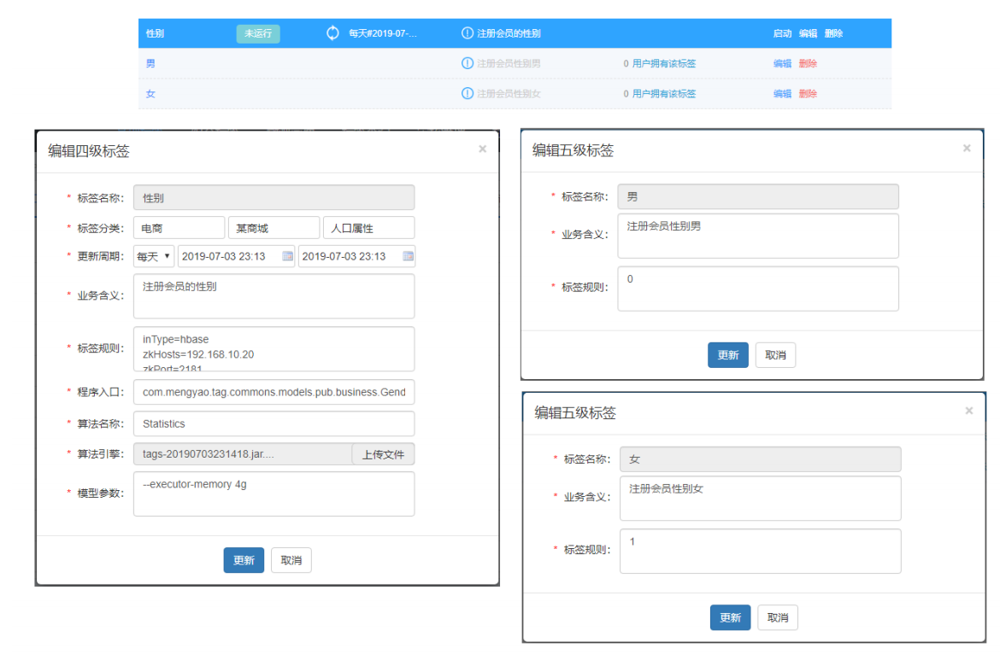
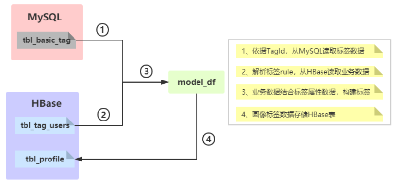
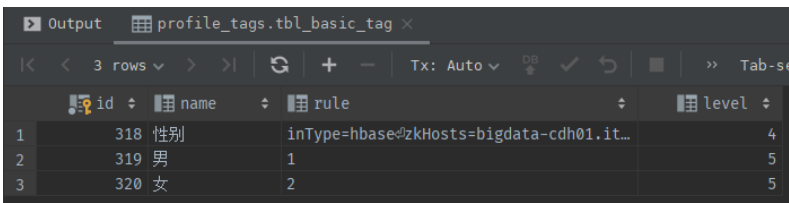
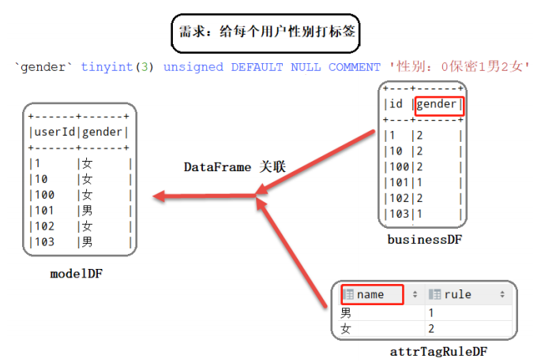
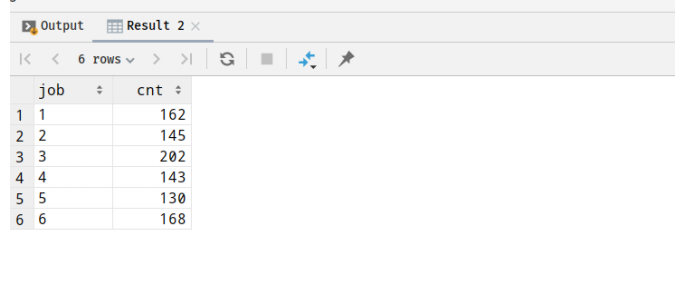
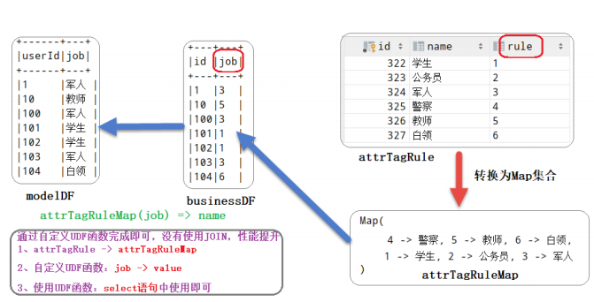

### 标签模型： 用户性别标签

> 向以规则匹配中性别标签为例，开发整个标签模型，熟悉开发过程，对标签的构建整体认识，如下为管理平台首先需要新建标签

标签模型开发具体流程，数据流程详细图如下所示：

~~~ mysql
CREATE TABLE `tbl_basic_tag` (
`id` bigint(20) NOT NULL AUTO_INCREMENT,
`name` varchar(50) DEFAULT NULL COMMENT '标签名称',
`industry` varchar(30) DEFAULT NULL COMMENT '行业、子行业、业务类型、标签、属
性',
`rule` varchar(300) DEFAULT NULL COMMENT '标签规则',
`business` varchar(100) DEFAULT NULL COMMENT '业务描述',
`level` int(11) DEFAULT NULL COMMENT '标签等级',
`pid` bigint(20) DEFAULT NULL COMMENT '父标签ID',
`ctime` datetime DEFAULT NULL COMMENT '创建时间',
`utime` datetime DEFAULT NULL COMMENT '修改时间',
`state` int(11) DEFAULT NULL COMMENT '状态：1申请中、2开发中、3开发完成、4已上
线、5已下线、6已禁用',
`remark` varchar(100) DEFAULT NULL COMMENT '备注',
PRIMARY KEY (`id`)
) ENGINE=InnoDB AUTO_INCREMENT=307 DEFAULT CHARSET=utf8 COMMENT='基础标签
表';

CREATE TABLE `tbl_model` (
`id` bigint(20) NOT NULL AUTO_INCREMENT,
`tag_id` bigint(20) DEFAULT NULL,
`model_name` varchar(200) DEFAULT NULL,
`model_main` varchar(200) DEFAULT NULL,
`model_path` varchar(200) DEFAULT NULL,
`sche_time` varchar(200) DEFAULT NULL,
`ctime` datetime DEFAULT NULL,
`utime` datetime DEFAULT NULL,
`state` int(11) DEFAULT NULL,
`args` varchar(100) DEFAULT NULL,
PRIMARY KEY (`id`)
) ENGINE=InnoDB AUTO_INCREMENT=2 DEFAULT CHARSET=utf8;

-- 1、基础标签tbl_basic_tag
INSERT INTO `tbl_basic_tag` VALUES ('318', '性别', null,
'inType=hbase\nzkHosts=bigdatacdh01.itcast.cn\nzkPort=2181\nhbaseTable=tbl_tag_users\nfamily=detail\nselec
tFieldNames=id,gender', null, '4', '314', '2019-12-03 11:11:54', '2019-12-03
11:11:54', null, null);
INSERT INTO `tbl_basic_tag` VALUES ('319', '男', null, '1', null, '5',
'318', '2019-12-03 11:28:03', '2019-12-03 11:28:03', null, null);
INSERT INTO `tbl_basic_tag` VALUES ('320', '女', null, '2', null, '5',
'318', '2019-12-03 11:28:39', '2019-12-03 11:28:39', null, null);

-- 2、模型表tbl_model
INSERT INTO `tbl_model` VALUES ('1', '318', 'MATCH',
'cn.itcast.tags.models.rule.GenderModel', 'hdfs://bigdatacdh01.itcast.cn:8020/apps/temp/jars/9f0d015b-8535-4538-8722-
1d9a331069d1.jar', '4,2019-12-03 10:00:00,2029-12-03 10:00:00', '2019-12-03
11:11:54', '2019-12-03 11:11:54', '4', '--driver-memory 512m --executormemory 512m --num-executors 1 --executor-cores 1');
~~~

相关字段信息如下：

~~~ shell
标签名称：性别
标签分类：电商-某商城-人口属性
更新周期：
业务含义：注册会员的性别
标签规则：
inType=hbase
zkHosts=bigdata-cdh01.itcast.cn
zkPort=2181
hbaseTable=tbl_tag_users
family=detail
selectFieldNames=id,gender
程序入口：
cn.itcast.tags.models.rule.GenderModel
算法名称：
MATCH
算法引擎：
tags-model_2.11.jar
模型参数：
--driver-memory 512m --executor-memory 512m --num-executors 1 --
executor-cores 1
~~~

主要分为四个步骤：

~~~shell
// 1 依据TagId,从MySQL读取标签数据
// 2 解析标签rule,从HBase读取业务数据
// 3 业务数据结合标签属性数据，构建标签
// 4 画像标签数据存储HBase表
~~~

涉及技术核心点（难点）

~~~ shell
第一、如何从HBase表读取和写入数据
第二、标签匹配与标签合并
标签合并：将历史标签数据与计算标签数据进行合并
第三、基于DataFrame DSL开发
使用select,filter,groupBy,agg等函数，内置函数：functions._
~~~

标签数据读取

首先从基础标签表tbl_basic_tag 中读取性别相关的标签数据： 业务标签和属性标签。

依据业务标签ID读取标签相关的数据： 业务标签数据和对应属性标签数据，sql如下：

~~~mysql
(
SELECT `id`,
`name`,
`rule`,
`level`
FROM `profile_tags`.`tbl_basic_tag`
WHERE id = 318
UNION
SELECT `id`,
`name`,
`rule`,
`level`
FROM `profile_tags`.`tbl_basic_tag`
WHERE pid = 318
ORDER BY `level` ASC, `id` ASC
) AS basic_tag
~~~

查询结果如下： 

读取Hbase表的业务数据：

业务数据存储在HBase表中，此处采用TableInputFormt的方式读取数据，编写工具类，其中涉及如何将RDD转换为DataFrame。

构建标签：

依据获取的业务属性标签数据中的规则，进行关联匹配，构建每个用户的性别标签，如下图示：

### 标签模型：职业标签

在标签管理平台新建对应的标签（业务标签和属性标签），编写标签模型类，实现标签计算。

~~~mysql
`job` varchar(60) DEFAULT NULL COMMENT '职业；1学生、2公务员、3军人、4警察、5教
师、6白领'
-- SQL 语句
SELECT job, COUNT(1) AS cnt FROM tags_dat.tbl_users GROUP BY job ;
~~~

**新建标签**

新建业务（4级）标签：职业标签，相关字段信息如下：

~~~shell
标签名称：职业
标签分类：电商-某商城-人口属性
更新周期：
业务含义：注册用户的职业
标签规则：
inType=hbase
zkHosts=bigdata-cdh01.itcast.cn
zkPort=2181
hbaseTable=tbl_tag_users
family=detail
selectFieldNames=id,job
程序入口：
cn.itcast.tags.models.rule.JobModel
算法名称：
MATCH
算法引擎：
tags-model_2.11.jar
模型参数：
--driver-memory 512m --executor-memory 512m --num-executors 1 --
executor-cores 1
~~~

新建属性（5级）标签：1 学生、 2 公务员、3 军人、4 警察、5 教师、6 白领，相关字段信息

**模型开发**

在标签管理平台web新建标签，（业务标签4级标签和属性标签5级标签），参考用户性别标签模型修改其中标签的计算部分，使用UDF函数，完成标签匹配计算。

